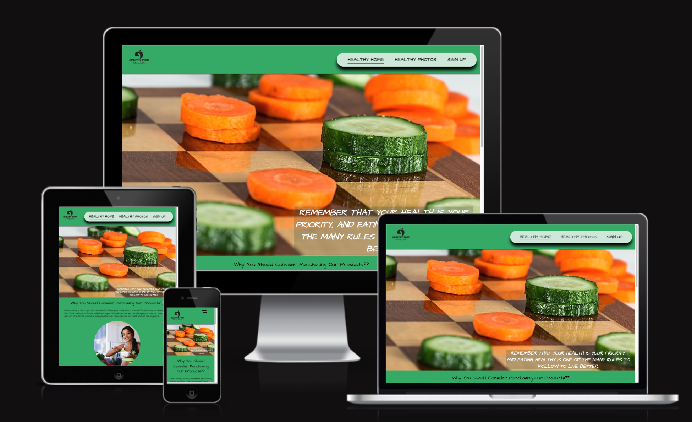
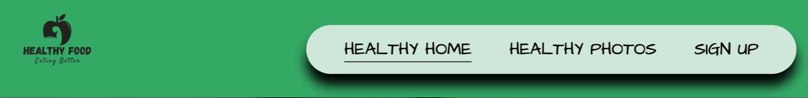
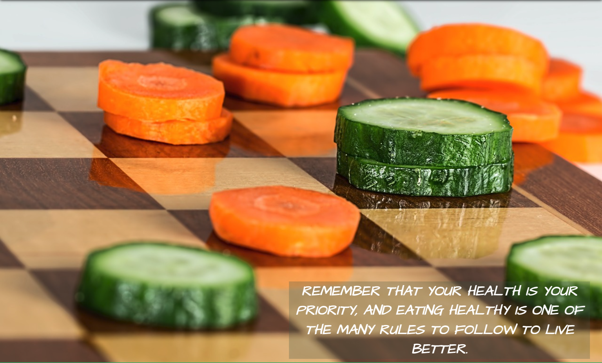
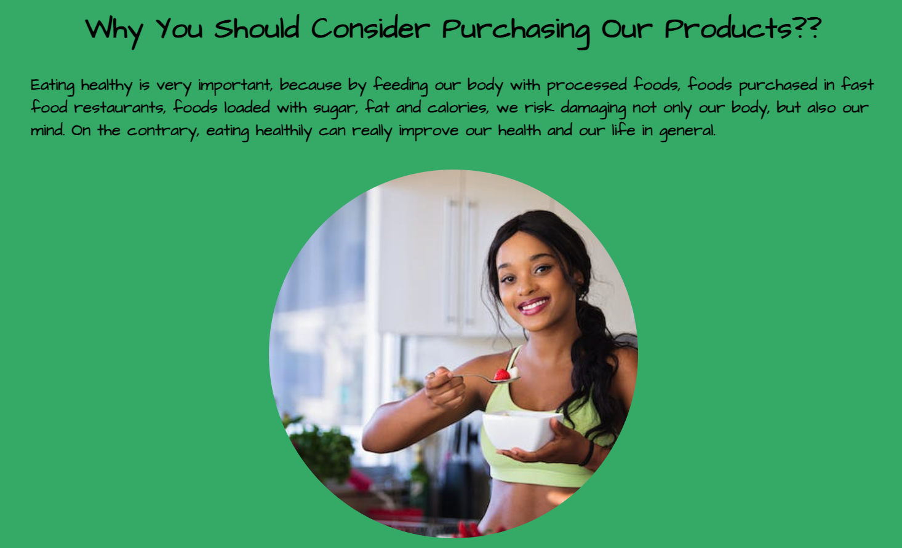
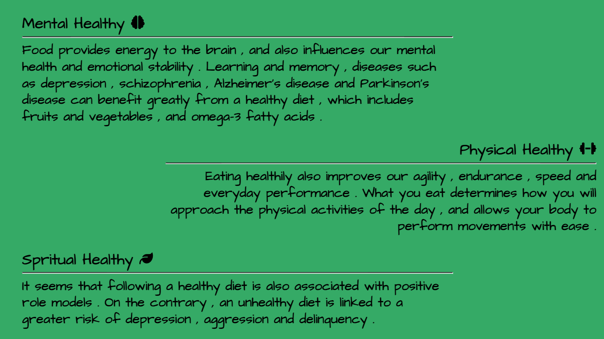

# Healthy Food

Healthy Food is a food company specialized in the wholesale sale of strictly organic fruit and vegetables. In addition to this, Healthy Food supplies other types of natural ingredients for wholesale sales only upon request via the appropriate website.
On the Healthy Food website there is a special section to register and keep up to date on the company's movements and a 24-hour customer service section where the staff will try to respond as briefly as possible.

A Gallery section has been added to show customers the quality of the products, sparking interest.
Finally on the home page there is a small description on why to buy from Healthy Food with a meeting section to discuss any purchases/contracts/sponsors/collaborations.

[View Healthy Food project here](https://t0tacci0.github.io/HealthyFood-1P/)

---

## Table of Contents

### [User Experience (UX)](#user-experience-ux-1)

- [User Stories](#user-stories)

### [Features](#features)

- [Existing Features](#existing-features)

### [Features Left to Implement](#features-left-to-implement-1)

### [Design](#design-1)

### [Technologies Used](#technologies-used-1)

### [Frameworks, Libraries & Programs Used](#frameworks-libraries--programs-used-1)

### [Testing](#testing-1)

- [Validation Results](#validation-results)
- [Manual Testing](#manual-testing)
- [Lighthouse Report](#lighthouse-report)

### [Deployment and local development](#deployment-and-local-development-1)

- [GitHub Pages](#github-pages)
- [Forking the GitHub Repository](#forking-the-github-repository)
- [Local Clone](#local-clone)

### [Credits](#credits-1)

### [Acknowledgements](#acknowledgements-1)

---

## User Experience (UX)

The site is aimed at people who want to sell Naural/Organic ingredients and product.

There is a section for registering, a section for customer service and one for appointments with managers to discuss various purchasing options.

### User Stories

- First-time visitor goals
  - Understand the main purpose of the site and learn more about the Healthy Food company.
  - Easily navigate throughout the site.
  - Find the Sign Up form and fill it out.
- Returning visitor goals
  - Find out information about the company.
  - Locate contact links information.
  - Review the site's extensive gallery.

- Frequent user goals
  - Check if there are any new personal offers to apply for in the sign-up form.
  - Review the gallery for any new photos.

- - -

## Features

- This website is targeting people who want start business and selling products.
- They can do that by navigating to the sign-up page and filling out a form.
- Responsive on all device sizes.

### Existing Features

- Navigation bar
  - It is featured and fixed on all three pages and the contact us form.
  - Includes links to the logo, home page, gallery, and sign-up page.
  - It is identical in design across the pages.
  - Allows easy navigation from page to page without having to revert back to the previous page via the "back" button.

- Main heading
  - It is composed of a green background.
  
- Section one.
  - This section contains a short heading followed by image.
  - It gives a presentation with a checkers to attract perople.
  

- Section two, 'Why You Should Consider Purchasing Our Products??'
  - Information about risks of eating in bad way.

- Section three.
  - Information about consequences eating healthy.
  

- Footer
  - Links to the social media for Healthy Food will open in a new tab to allow easy navigation for the user.
  - It is valuable to the user as it gives them an easy contact option via social media.
  - Contact Us page Form with customer service active all day.

