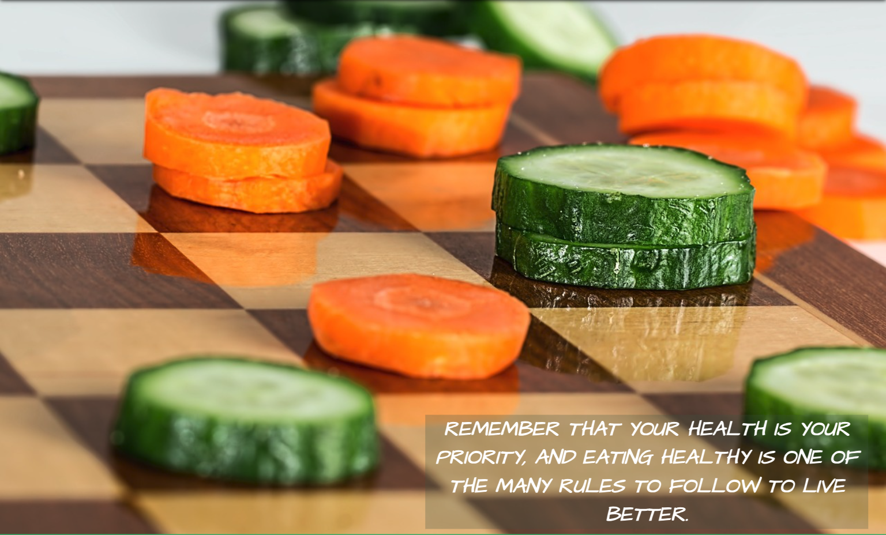
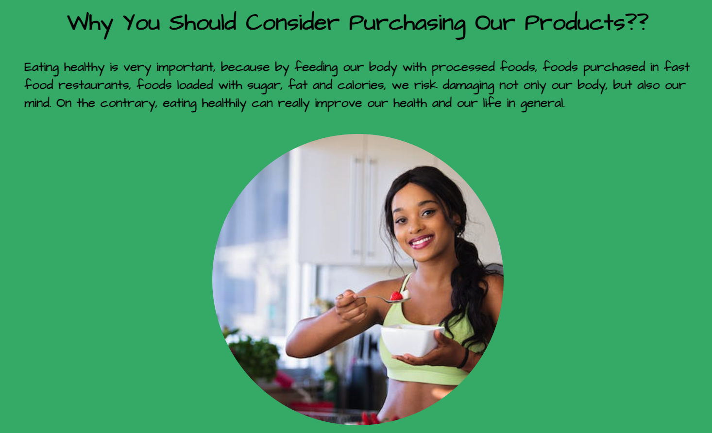
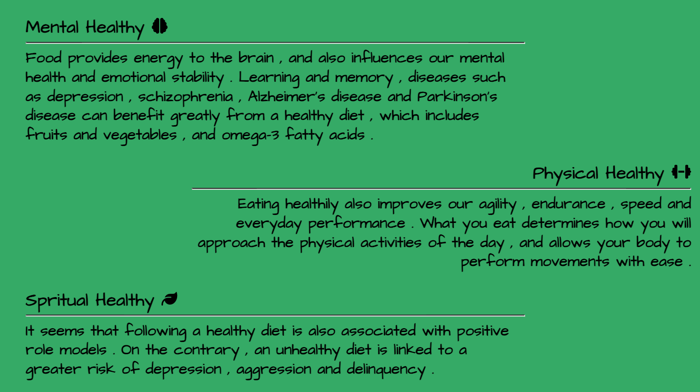
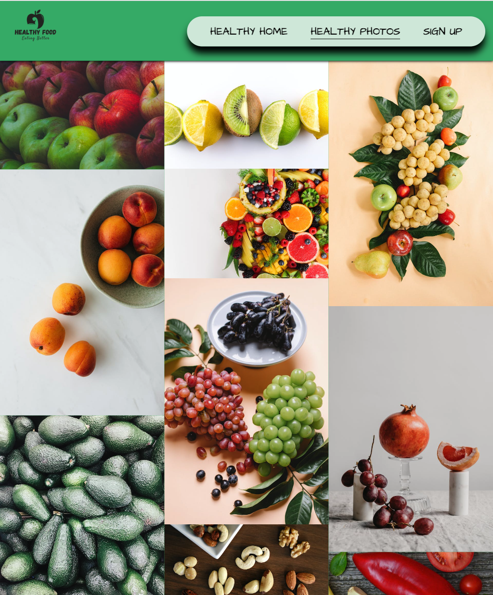
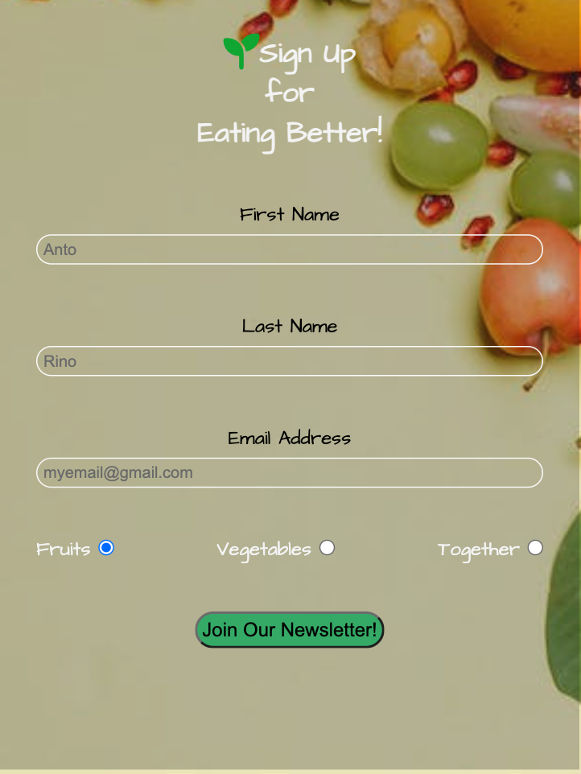
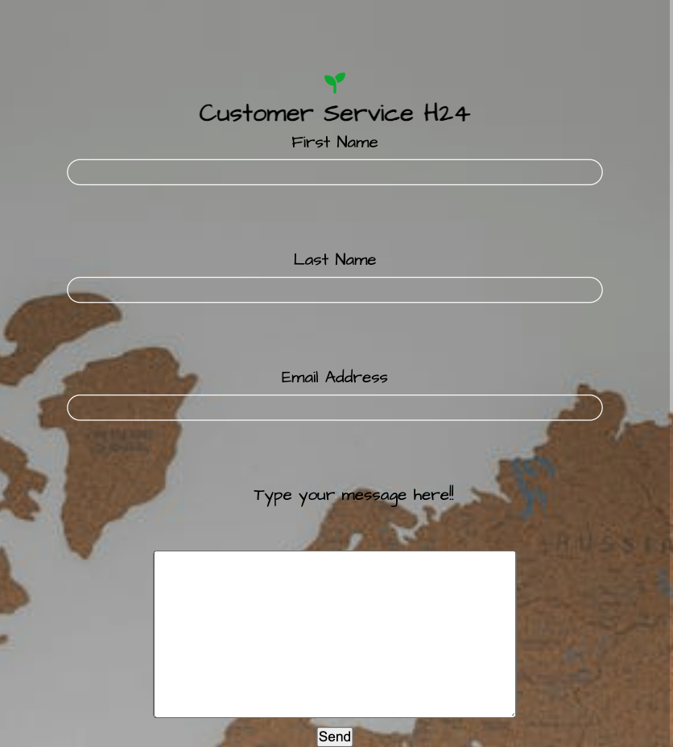
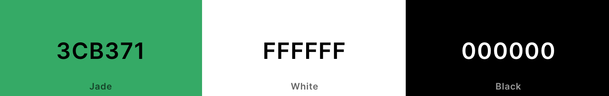

# Healthy Food

Healthy Food is a food company specialized in the wholesale sale of strictly organic fruit and vegetables. In addition to this, Healthy Food supplies other types of natural ingredients for wholesale sales only upon request via the appropriate website.
On the Healthy Food website there is a special section to register and keep up to date on the company's movements and a 24-hour customer service section where the staff will try to respond as briefly as possible.

A Gallery section has been added to show customers the quality of the products, sparking interest.
Finally on the home page there is a small description on why to buy from Healthy Food with a meeting section to discuss any purchases/contracts/sponsors/collaborations.

[View Healthy Food project here](https://t0tacci0.github.io/HealthyFood-1P/)

---

## Table of Contents

### [User Experience (UX)](#user-experience-ux-1)

- [User Stories](#user-stories)

### [Features](#features)

- [Existing Features](#existing-features)

### [Features Left to Implement](#features-left-to-implement-1)

### [Design](#design-1)

### [Technologies Used](#technologies-used-1)

### [Frameworks, Libraries & Programs Used](#frameworks-libraries--programs-used-1)

### [Testing](#testing-1)

- [Validation Results](#validation-results)
- [Manual Testing](#manual-testing)
- [Lighthouse Report](#lighthouse-report)

### [Deployment and local development](#deployment-and-local-development-1)

- [GitHub Pages](#github-pages)
- [Forking the GitHub Repository](#forking-the-github-repository)
- [Local Clone](#local-clone)

### [Credits](#credits-1)

### [Acknowledgements](#acknowledgements-1)

---

## User Experience (UX)

The site is aimed at people who want to sell Naural/Organic ingredients and product.

There is a section for registering, a section for customer service and one for appointments with managers to discuss various purchasing options.

### User Stories

- First-time visitor goals
  - Understand the main purpose of the site and learn more about the Healthy Food company.
  - Easily navigate throughout the site.
  - Find the Sign Up form and fill it out.
- Returning visitor goals
  - Find out information about the company.
  - Locate contact links information.
  - Review the site's extensive gallery.

- Frequent user goals
  - Check if there are any new personal offers to apply for in the sign-up form.
  - Review the gallery for any new photos.

- - -

## Features

- This website is targeting people who want start business and selling products.
- They can do that by navigating to the sign-up page and filling out a form.
- Responsive on all device sizes.

### Existing Features

- Navigation bar
  - It is featured and fixed on all three pages and the contact us form.
  - Includes links to the logo, home page, gallery, and sign-up page.
  - It is identical in design across the pages.
  - Allows easy navigation from page to page without having to revert back to the previous page via the "back" button.

- Main heading
  - It is composed of a green background.
  
- Section one.
  - This section contains a short heading followed by image.
  - It gives a presentation with a checkers to attract perople.
  

- Section two, 'Why You Should Consider Purchasing Our Products??'
  - Information about risks of eating in bad way.

- Section three.
  - Information about consequences eating healthy.
  

- Footer
  - Links to the social media for Healthy Food will open in a new tab to allow easy navigation for the user.
  - It is valuable to the user as it gives them an easy contact option via social media.
  - Contact Us page Form with customer service active all day.

* Gallery 
    * The gallery will provide users with supporting images to see all kind of products.
    * This section is valuable to the user as they will see a helpful gallery of product that they can request.

* The Sign Up page
    * This page will allow users to choose three types of newsletter and sign up for it.
    * In the future there will be more types and option to choose.

* The Contact Us page
    * This page allow users to contact customer service active 24hours or in some cases they will get back to users asap.
    * There is a huge textarea to explain all problems of users.

---

## Features Left to Implement

* Meeting section will be available soon.
* Updated gallery with additional images.
* In the future there will be more options for form section.

## Design

 * Colour Scheme
    * Primary colors used on the website: 

 * Typography
    * Architects daughter font is main font used throughout the site with sans-serif as its fallback font in case Kanit doesn't import for some reason.

 * Wireframes
    * Pen and paper in a notebook.
---

## Technologies Used

 * [HTML5](https://en.wikipedia.org/wiki/HTML5)
 * [CSS3](https://en.wikipedia.org/wiki/CSS)

---

## Frameworks, Libraries & Programs Used
 * [Codeanywhere](https://codeanywhere.com/platform)
    * Program used for coding
 * [Github](https://github.com/)
    * Deployment of the website and storing the files online.
 * [Google Fonts](https://fonts.google.com/)
    * Import main font the website.
* [Am I Responsive](https://ui.dev/amiresponsive)
    * Mockup picture for the README file.
---

## Testing

The W3C Markup Validator and W3C CSS Validator services were used to validate every page of the project to ensure there were no errors.

 * [W3C Markup Validtor](https://validator.w3.org/)
 * [W3C CSS Validator](https://jigsaw.w3.org/css-validator/)

### Validation results

index.html

gallery.html

sign-up.html

contactus.html

style.css

### Manual Testing

* The website was tested on Google Chrome, Microsoft Edge, and Safari.
* The website was viewed on a desktop computer, laptop, Samsung Galaxy Fold, iPad mini, iPhone 12 pro.
* A large amount of testing was done to ensure links between pages are working correctly on all pages.
* Dev Tools was used to test how the site looks on various screen sizes.

## Deployment and local development

### GitHub Pages

GitHub Pages used to deploy live version of the website.

1. Log in to GitHub and locate [GitHub Repository HealthyFood-1P](https://github.com/t0tacci0/HealthyFood-1P)
2. At the top of the Repository(not the main navigation) locate "Settings" button on the menu.
3. Scroll down the Settings page until you locate "GitHub Pages".
4. Under "Source", click the dropdown menu "None" and select "Main" and click "Save".
5. The page will automatically refresh.
6. Scroll back to locate the now-published site [link](https://t0tacci0.github.io/HealthyFood-1P/) in the "GitHub Pages" section.

### Forking the GitHub Repository

By forking the repository, we make a copy of the original repository on our GitHub account to view and change without affecting the original repository by using these steps:

1. Log in to GitHub and locate [GitHub Repository HealthyFood-1P](https://github.com/t0tacci0/HealthyFood-1P)
2. At the top of the Repository(under the main navigation) locate "Fork" button.
3. Now you should have a copy of the original repository in your GitHub account.

### Local Clone

1. Log in to GitHub and locate [GitHub Repository HealthyFood-1P](https://github.com/t0tacci0/HealthyFood-1P)
2. Under the repository name click "Clone or download"
3. Click on the code button, select clone with HTTPS, SSH or GitHub CLI and copy the link shown.
4. Open Git Bash
5. Change the current working directory to the location where you want the cloned directory to be made.
6. Type `git clone` and then paste The URL copied in the step 3.
7. Press Enter and your local clone will be created.

---

## Credits

### Code

- Understanding the concept of flexbox was learned through [Complete Guide to Flexbox](https://css-tricks.com/snippets/css/a-guide-to-flexbox/)
- The README template was helpfully provided by [Code Institute (template)](https://github.com/Code-Institute-Solutions/SampleREADME)

### Content

- All content was written by the developer.
- [Color contrast checker](https://coolors.co/contrast-checker/112a46-acc8e5) Used to check colour for background.

### Media

- [Pexels](https://www.pexels.com/) Free stock photos, royalty free images.
- [Pixabay](https://pixabay.com/) Free stock photos, royalty free images.
- [Pixlr](https://pixlr.com/) Resizing images.
- [Canva](https://www.canva.com/en/) Create Healthy Food logo.
- [Fontawesome](https://fontawesome.com/) Create fonts.
- [Am I Responsive](https://ui.dev/amiresponsive) Check website responsive.

---

## Acknowledgements

- My mentor Mitko Bachvarov provided great helpful feedback and a link to the Flexbox guide.
- Slack community for encouragement and information.
